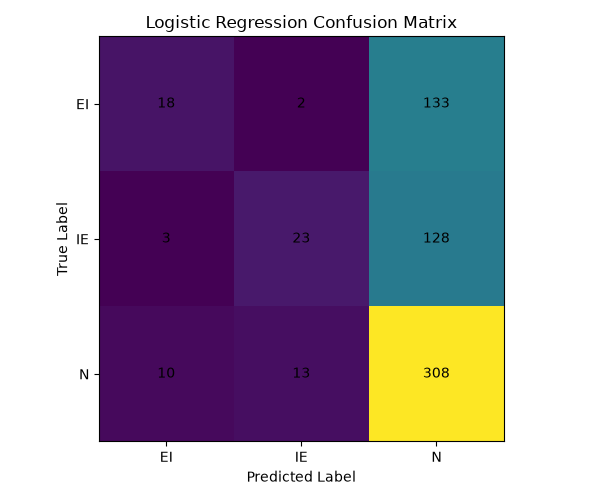
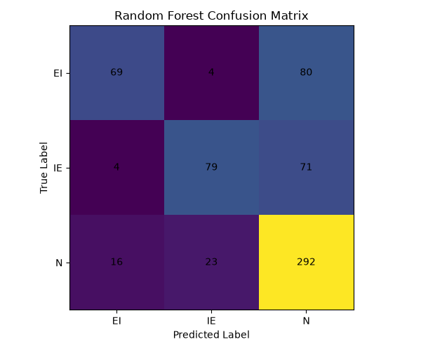
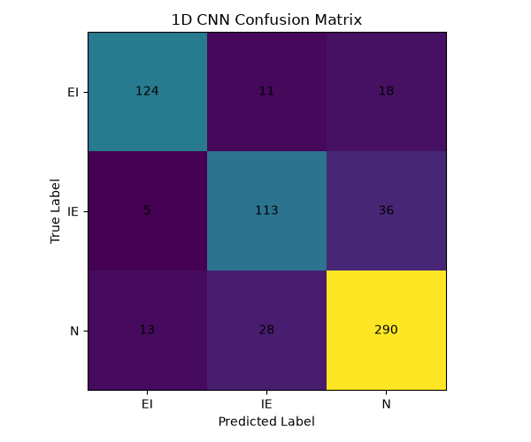
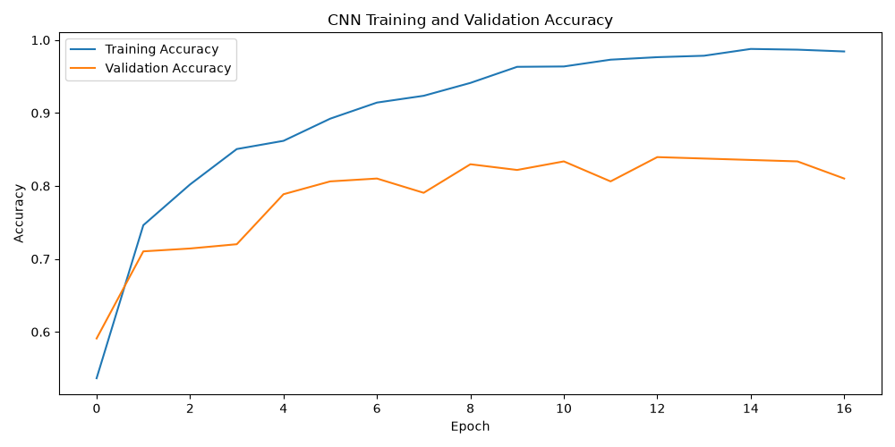

# DNA Splice-Junction Classification

A machine learning and deep learning project for classifying DNA sequences around splice-junction sites into three biological categories:

- EI — Exon-Intron
- IE — Intron-Exon
- N — Neither

The project uses the UCI Molecular Biology Splice Junction dataset and compares classical machine learning approaches with a 1D Convolutional Neural Network (CNN).

## Overview

Splice junctions are regions in DNA where exon and intron boundaries occur. Correctly identifying these regions is an important task in computational biology and bioinformatics.

This project explores how machine learning models can learn patterns from 60-base DNA sequences and classify them into three categories:

| Class | Meaning |
|---|---|
| EI | Exon-Intron junction |
| IE | Intron-Exon junction |
| N | Neither |

Three different approaches are implemented and compared:

1. Logistic Regression using k-mer features
2. Random Forest using k-mer features
3. 1D Convolutional Neural Network using one-hot encoded DNA sequences

## Objectives

- Load and preprocess DNA sequence data.
- Convert nucleotide sequences into machine-learning representations.
- Build classical machine learning baselines.
- Build a deep learning model using a 1D CNN.
- Compare model performance using classification metrics.
- Visualize confusion matrices.
- Save the trained deep learning model.
- Build an interactive web application for DNA sequence prediction.
- Deploy the application publicly using Streamlit Community Cloud.

## Dataset

The project uses the UCI Molecular Biology Splice Junction dataset.

Dataset source:

UCI Machine Learning Repository  
https://archive.ics.uci.edu/dataset/69/molecular+biology+splice+junction+gene+sequences

Dataset characteristics:

- 3,190 DNA sequences
- 60 nucleotide positions per sequence
- 3 classification classes
- EI: 767 samples
- IE: 768 samples
- N: 1,655 samples
- License: CC BY 4.0

The dataset contains DNA sequences surrounding splice-junction sites and is used as the basis for training and evaluating the models.

## Feature Representation

Two different representations are used.

### 1. K-mer Features

For the classical machine learning models, DNA sequences are transformed into normalized k-mer frequency vectors.

The project uses 3-mers.

For example:

```text
ATGCGT
```

can be represented through overlapping 3-mers:

```text
ATG
TGC
GCG
CGT
```

All possible combinations of A, C, G, and T are considered.

For k = 3:

```text
4^3 = 64
```

possible 3-mers are represented as numerical features.

### 2. One-Hot Encoding

For the CNN model, each nucleotide is represented as a four-dimensional vector.

```text
A = [1, 0, 0, 0]
C = [0, 1, 0, 0]
G = [0, 0, 1, 0]
T = [0, 0, 0, 1]
```

A 60-base DNA sequence therefore becomes a numerical array with the shape:

```text
60 × 4
```

This representation allows the CNN to learn local sequence patterns directly from the nucleotide sequence.

## Models

### Logistic Regression

Logistic Regression is used as a classical baseline.

Input:

- 3-mer frequency features

Purpose:

- Establish a simple baseline.
- Provide a reference point for comparison with more complex models.

### Random Forest

Random Forest is used as a second classical machine learning model.

Input:

- 3-mer frequency features

The model combines multiple decision trees to learn nonlinear relationships between DNA sequence features and the target classes.

### 1D Convolutional Neural Network

A 1D CNN is trained directly on one-hot encoded DNA sequences.

The CNN is designed to learn local nucleotide patterns that may be useful for identifying splice-junction classes.

The training process uses:

- One-hot encoded sequences
- Convolutional layers
- Pooling
- Dense layers
- Early stopping
- Validation monitoring

## Results

The models were evaluated on a held-out test set representing 20% of the dataset.

| Model | Accuracy | Weighted Precision | Weighted Recall | Weighted F1 |
|---|---:|---:|---:|---:|
| Logistic Regression | 54.70% | 56.62% | 54.70% | 45.98% |
| Random Forest | 68.97% | 70.78% | 68.97% | 67.49% |
| 1D CNN | 81.50% | 81.40% | 81.50% | 81.26% |

The CNN achieved 81.50% accuracy and a weighted F1 score of 81.26% on this particular test split.

These results represent the current experimental setup and should not be interpreted as a general performance guarantee.

## Evaluation

### Logistic Regression Confusion Matrix



### Random Forest Confusion Matrix



### CNN Confusion Matrix



### CNN Accuracy During Training



## Interactive Application

The project includes a Streamlit application that allows users to enter a 60-base DNA sequence and receive a prediction from the trained CNN model.

The application provides:

- Predicted class
- Prediction confidence
- Probability for each class
- Input validation

## Live Demo

[Launch the DNA Splice-Junction Predictor](https://eyaas848-dna-splice-junction-classification-app-ph3mho.streamlit.app/)

The application is publicly deployed using Streamlit Community Cloud.

## Example Prediction

A user can enter a DNA sequence such as:

```text
ATGCGTACGTTAGCGATCGATCGATCGATCGATCGATCGATCGATCGATCGATCGATCGT
```

The application validates the sequence and sends it to the trained CNN model for classification.

Example output from the deployed model:

```text
Prediction: Neither
Confidence: 72.84%
```

The displayed prediction depends on the input sequence provided to the application.

## Project Structure

```text
dna-splice-junction-classification/
│
├── data/
│   ├── raw/
│   │   └── .gitkeep
│   └── processed/
│       └── .gitkeep
│
├── notebooks/
│   ├── 01_exploration.ipynb
│   ├── 02_baseline_models.ipynb
│   └── 03_deep_learning.ipynb
│
├── src/
│   ├── __init__.py
│   ├── download_data.py
│   ├── preprocessing.py
│   ├── features.py
│   ├── train.py
│   └── predict.py
│
├── models/
│   ├── .gitkeep
│   ├── cnn_accuracy.png
│   ├── cnn_confusion_matrix.png
│   ├── dna_splice_cnn.keras
│   ├── logistic_confusion_matrix.png
│   ├── random_forest_confusion_matrix.png
│   └── results.json
│
├── app.py
├── requirements.txt
├── README.md
├── .gitignore
└── LICENSE
```

## Workflow

The project follows this general workflow:

```text
UCI Dataset
     |
     v
Data Download
     |
     v
Data Cleaning
     |
     v
DNA Sequence Construction
     |
     +----------------------+
     |                      |
     v                      v
3-mer Features        One-Hot Encoding
     |                      |
     v                      v
Logistic Regression   1D CNN
     |                      |
     v                      v
Random Forest         Evaluation
     |                      |
     +----------+-----------+
                |
                v
        Model Comparison
                |
                v
       Trained CNN Model
                |
                v
        Streamlit Application
                |
                v
           Live Deployment
```

## Installation

Clone the repository:

```bash
git clone https://github.com/eyaas848/dna-splice-junction-classification.git
```

Navigate into the project directory:

```bash
cd dna-splice-junction-classification
```

Create a virtual environment:

```bash
python -m venv .venv
```

Activate the virtual environment on Windows PowerShell:

```powershell
.venv\Scripts\Activate.ps1
```

Install the required dependencies:

```bash
pip install -r requirements.txt
```

## Download the Dataset

Run:

```bash
python src/download_data.py
```

This downloads the UCI Molecular Biology Splice Junction dataset and stores the raw feature and target files locally.

## Training

To train the models:

```bash
python src/train.py
```

The training script:

- Loads and preprocesses the dataset.
- Creates k-mer features.
- Trains Logistic Regression.
- Trains Random Forest.
- Creates one-hot encoded sequences.
- Builds and trains the 1D CNN.
- Evaluates all models.
- Generates confusion matrices.
- Generates the CNN accuracy plot.
- Saves the trained CNN model.
- Saves the experimental results to `models/results.json`.

## Running the Streamlit Application Locally

After training the model, run:

```bash
streamlit run app.py
```

The application will open in your browser.

The local application can then be used to enter DNA sequences and obtain predictions from the trained CNN.

## Prediction

The project also contains a prediction module:

```text
src/predict.py
```

The module:

- Loads the trained CNN model.
- Validates the DNA sequence.
- Converts the sequence into the required numerical representation.
- Generates class probabilities.
- Returns the predicted class and confidence.

The expected input is a DNA sequence containing exactly 60 bases.

## Technologies

The project was developed using:

- Python
- NumPy
- Pandas
- Scikit-learn
- TensorFlow
- Keras
- Matplotlib
- Streamlit
- UCI Machine Learning Repository
- Git
- GitHub

## Reproducibility

The project uses a fixed random state for the train/test split:

```text
random_state = 42
```

The dataset is split into:

```text
80% training
20% testing
```

Stratified splitting is used to preserve the class distribution between the training and testing sets.

## Future Improvements

Possible future improvements include:

- Hyperparameter tuning.
- Cross-validation.
- More extensive CNN architectures.
- Bidirectional recurrent neural networks.
- Transformer-based sequence models.
- Data augmentation techniques for DNA sequences.
- More detailed per-class evaluation.
- ROC and precision-recall curves.
- Model interpretability techniques.
- Comparison with additional bioinformatics approaches.
- Improved Streamlit interface.
- More extensive testing on independent datasets.

## Disclaimer

This project is an educational machine learning and bioinformatics project.

The predictions produced by the application should not be interpreted as medical, clinical, or diagnostic advice.

The model is trained and evaluated on the selected UCI dataset and its performance may not generalize to other biological datasets or real-world genomic applications.

## Author

Aya

Computer Engineering Student

Focus: Artificial Intelligence and Data Science
